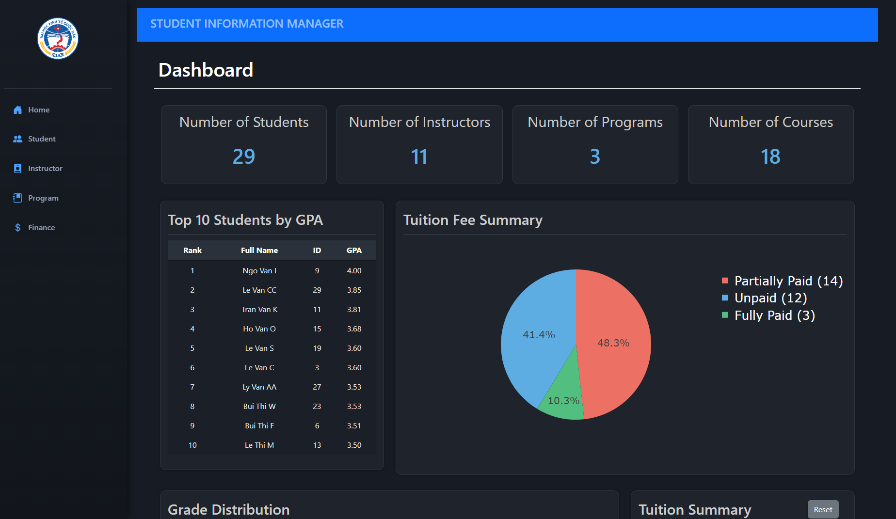
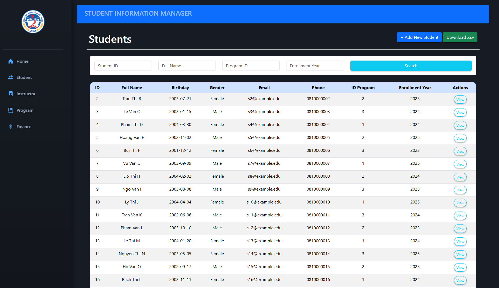
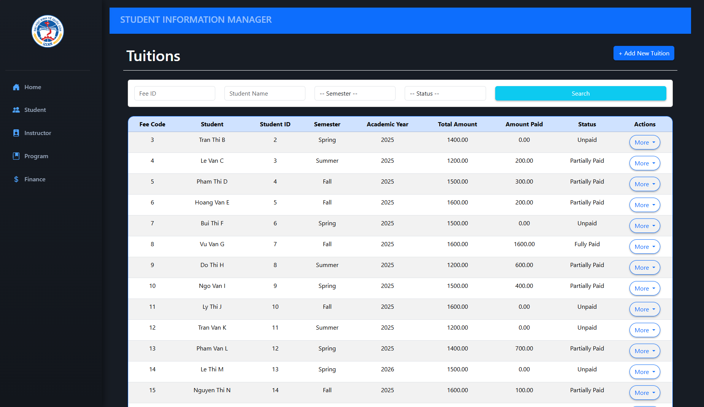

# 🏫 NEU Student Information Manager

<p align="center">
  
  
  
  
</p>

---

## 📑 Mục lục
- [Giới thiệu dự án](#-giới-thiệu-dự-án)
- [Screenshot & Demo](#-screenshot--demo)
- [Hướng dẫn cài đặt](#-hướng-dẫn-cài-đặt)
- [Cách dùng & Ví dụ](#-cách-dùng--ví-dụ)
- [Khắc phục lỗi phổ biến](#-khắc-phục-lỗi-phổ-biến)
- [FAQ](#-faq--câu-hỏi-thường-gặp)
- [Phụ thuộc](#-phụ-thuộc-dependencies)
- [Đội ngũ phát triển](#-đội-ngũ-phát-triển)
- [Tài liệu tham khảo](#-tài-liệu-tham-khảo)
- [Giấy phép](#-giấy-phép)
- [Những lỗi đã biết](#-những-lỗi-đã-biết-known-issues)
- [Huy hiệu](#-huy-hiệu-badge--optional)

---

## 📘 Giới thiệu dự án

**NEU Student Information Manager** là hệ thống quản lý thông tin sinh viên dành cho trường Đại học Kinh tế Quốc dân, cho phép quản trị viên quản lý sinh viên, học phí, chương trình đào tạo, và các nghiệp vụ liên quan.

### 🎯 Mục tiêu
- Hỗ trợ quản lý sinh viên nhanh chóng và chính xác.
- Tự động hóa các thao tác nhập liệu, thống kê và cập nhật học phí.
- Giao diện trực quan, dễ sử dụng.

**NEU student Information Manager" đã được chúng tôi triển khai trực tiếp lên server và được tích hợp CI/CD giúp tự động build – deploy mỗi khi cập nhật mã nguồn, đảm bảo tính ổn định và liên tục của sản phẩm.
### 🚀 Trải nghiệm ngay
- **Server demo**: *(Thêm link server tại đây)*
- **Video giới thiệu YouTube**: *(Thêm link YouTube tại đây)*

---

## 📸 Screenshot & Demo
Thêm ảnh bằng cách tải lên folder `screenshots/` hoặc sử dụng đường dẫn tuyệt đối.

### 🌐 Giao diện Dashboard


### 🧾 Quản lý Sinh viên


### 💰 Quản lý Học phí


### 🎞️ Demo GIF thao tác


---
Thêm hình ảnh mô phỏng giao diện tại đây (PNG/JPG/GIF):
- Dashboard quản lý
- Form thêm sinh viên
- Biểu đồ thống kê học phí
- GIF thao tác sử dụng

---

## 🔧 Hướng dẫn cài đặt

### 1️⃣ Clone dự án
```bash
git clone https://github.com/Dai-Nguyen1506/neu_student_infomation_manager.git
cd neu_student_infomation_manager
```

### 2️⃣ Tạo môi trường ảo
```bash
python -m venv venv       # python 3.12.0
source venv/bin/activate  # trên Linux/Mac
venv\Scripts\activate     # trên Windows
```

### 3️⃣ Cài đặt thư viện
```bash
pip install -r requirements.txt
```

### 4️⃣ Cấu hình database
- Tạo database MySQL
- Import file SQL mẫu vào database
- Cập nhật file cấu hình `config.py`

### 5️⃣ Chạy server Flask
```bash
flask run
```
Server chạy tại: `http://localhost:5000`

---

## 📚 Cách dùng & Ví dụ
Ứng dụng cung cấp giao diện web trực quan cho quản trị viên và API backend cho các dịch vụ mở rộng.

### 💡 Chức năng chính
- Quản lý sinh viên (CRUD)
- Quản lý học phí theo năm học, học kỳ
- Quản lý chương trình đào tạo
- Biểu đồ thống kê bằng Plotly
- Hệ thống validation và thông báo lỗi thân thiện

### 🧪 Ví dụ API
### ↪️ Các chức năng chính
- Quản lý sinh viên (CRUD)
- Quản lý học phí và chương trình đào tạo
- Dashboard trực quan (biểu đồ, thống kê)
- Hệ thống thông báo lỗi và validation

### ↪️ Ví dụ gọi API
```python
# Lấy danh sách sinh viên
GET /students

# Thêm sinh viên
POST /students/add
```

---

## 🛠️ Khắc phục lỗi phổ biến
Bạn có thể gặp một số lỗi sau trong quá trình cài đặt hoặc chạy ứng dụng.

### ❗ DatabaseError: Access denied
➡️ Kiểm tra lại user/password MySQL trong `config.py`.

### ❗ ModuleNotFoundError
➡️ Chưa cài thư viện: chạy `pip install -r requirements.txt`.

### ❗ 500 Internal Server Error
➡️ Kiểm tra log trong terminal → thường do dữ liệu không hợp lệ.

---


## 📦 Phụ thuộc (Dependencies)
Hệ thống sử dụng các công nghệ sau:

### 🖥️ Backend
- Flask — Web framework
- MySQL Connector — Kết nối DB
- Flask-Bcrypt — Mã hóa mật khẩu
- Flask-WTF — Xử lý biểu mẫu
- SQLAlchemy (nếu dùng ORM)

### 🎨 Frontend
- Bootstrap 5
- Plotly
- FontAwesome Icons

### 🛢️ Database
- MySQL 8.0+
Các thư viện chính:
- Flask
- MySQL Connector
- Flask-Bcrypt
- Flask-WTF
- Jinja2
- Bootstrap 5
- Plotly (nếu dùng biểu đồ)

---

## 👨‍💻 Đội ngũ phát triển
### Thanh vien
- Nguyen Trong Dai
- Mai Huy Dang
- Nguyen Ngan An
- Mai Tuan Manh

### Co van hoc thuat
- Dr. Tran Duc Minh (Dai hoc Kinh te Quoc dan)

---

## 📖 Tài liệu tham khảo & URL liên quan
- Flask Documentation
- MySQL Documentation
- Bootstrap Docs
- Plotly Guide
- Python Official Docs
- Flask Documentation
- MySQL Documentation
- Bootstrap Docs
- Plotly Docs

---

## 📄 Giấy phép
Dự án sử dụng giấy phép **MIT License**. Tự do sử dụng và chỉnh sửa.

---

## 🏷️ Huy hiệu (Badge – Optional)
<p align="center">
  
  
</p>
 Huy hiệu (Badge – Optional)
<p align="center">
  
  
</p>

```md


```

---

## 📌 Ghi chú
README sẽ tiếp tục được cập nhật theo phiên bản mới nhất của dự án.
